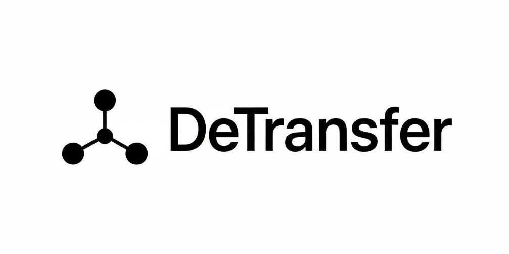

# DeTransfer

DeTransfer is a decentralized file transfer protocol designed to provide secure, censorship-resistant, and verifiable data delivery across distributed storage and blockchain networks. The project integrates three core components:

* **Walrus** for decentralized storage
* **Sui** for ledger-based verification, proofs, and settlement
* **Seal** for routing, orchestration, and secure transfer logic

This ensures trustless file movement, integrity checks, and seamless cross-network interoperability.


---

## Features

### 1. Secure Distributed Storage

Detransfer leverages Walrus to store files redundantly across decentralized nodes. Files are chunked, replicated, and distributed to provide durability and availability.

### 2. On-Chain Verification

Sui acts as the execution and verification layer. It provides proofs of upload, access permissions, ownership state, and transaction integrity.

### 3. Routing and Control Layer

Seal manages the routing, orchestration, and secure transfer handshake between the uploader, storage network, and recipient.

### 4. End-to-End Encryption

All files are encrypted client-side before upload to ensure only authorized recipients can access them.

### 5. Auditable Transfers

Each transfer generates verifiable metadata, allowing users to trace file delivery and confirm authenticity.

---

## How It Works

1. **User Uploads File:** Data is encrypted locally and chunked.
2. **Walrus Stores Data:** Chunks are distributed across decentralized nodes.
3. **Seal Orchestrates Transfer:** Routes the request, manages session tokens, and ensures recipient authorization.
4. **Sui Validates:** Writes proofs, maintains transfer state, and ensures trustless verification.
5. **Recipient Downloads:** Data is reconstructed client-side and decrypted.

---

## Setup Instructions

### Prerequisites

* Node.js
* Sui CLI
* Walrus client
* Rust (if running Seal backend)
* Git

### Installation

```bash
git clone <repository-url>
cd detransfer
```

### Running the Client

```bash
cd client
npm install
npm run dev
```

### Deploying Sui Contracts

```bash
sui move build
sui client publish --gas-budget 10000000
```

### Running the Seal Backend

```bash
cd seal
cargo run
```

---

## Use Cases

* Secure file sharing for teams
* Transfer of sensitive documents
* Decentralized backups
* Verified delivery for enterprise workflows

---

## Roadmap

* Multi-device sessions
* Temporary share links with programmable access
* Privacy-preserving audit trails
* Desktop and mobile clients

---

