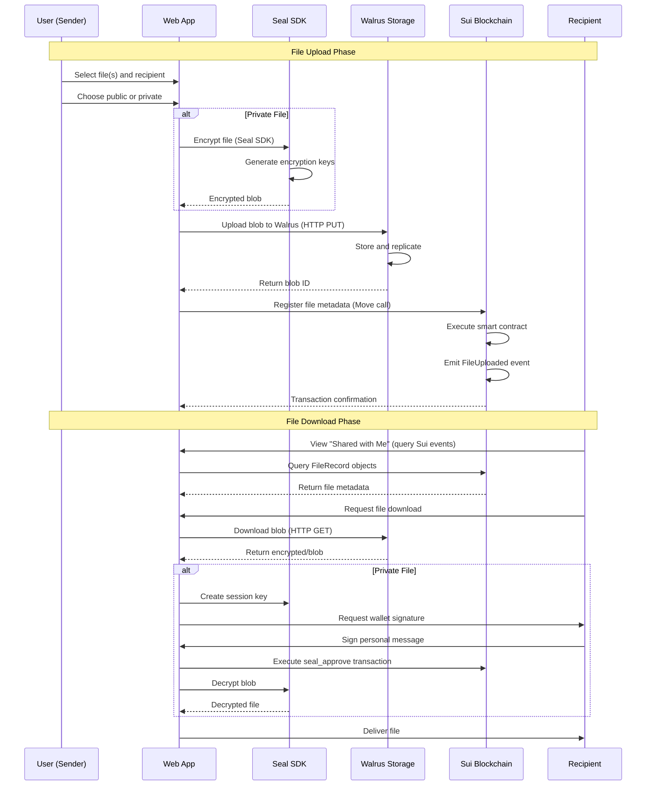

<div align="center">

# DeTransfer

### Decentralized File Transfer Protocol


[](https://sui.io)
[](https://walrus.site)
[]()

**Secure • Decentralized • Verifiable**


[Features](#key-features) • [Architecture](#architecture) • [Getting Started](#getting-started) • [Documentation](#documentation) • [Roadmap](#roadmap)

</div>

---

## Table of Contents

- [Overview](#overview)
- [Key Features](#key-features)
- [Architecture](#architecture)
- [Workflow Diagram](#workflow-diagram)
- [Technology Stack](#technology-stack)
- [Getting Started](#getting-started)
- [Usage](#usage)
- [Smart Contracts](#smart-contracts)
- [Use Cases](#use-cases)
- [Security](#security)
- [Roadmap](#roadmap)
- [Contributing](#contributing)
- [License](#license)

---

## Overview

**DeTransfer** is a fully decentralized file transfer application that combines the power of distributed storage, blockchain verification, and end-to-end encryption to provide censorship-resistant, verifiable, and trustless data delivery.

Unlike traditional file-sharing services, DeTransfer eliminates single points of failure and central authority control by leveraging a client-side architecture:

- **Storage Layer (Walrus)** - Decentralized storage with redundancy and high availability
- **Verification Layer (Sui)** - Blockchain-based metadata storage, ownership, and state management
- **Encryption Layer (Seal)** - Client-side end-to-end encryption SDK for recipient-only access

### Why DeTransfer?

- **No Central Authority** - Fully decentralized architecture
- **Cryptographic Verification** - Every transfer is provably secure
- **Censorship Resistant** - No single entity can block or monitor transfers
- **End-to-End Encryption** - Client-side encryption ensures privacy
- **Auditable & Transparent** - On-chain proofs enable verification
- **Cross-Network Interoperability** - Seamless integration across protocols

---

## Key Features

### 1. **Secure Distributed Storage**
DeTransfer leverages **Walrus** for decentralized storage, ensuring files are:
- Stored directly on the Walrus network without intermediaries
- Replicated across multiple independent nodes
- Resistant to data loss and censorship
- Configurable storage epochs (duration)
- Available with high durability guarantees

### 2. **Blockchain-Based Metadata Registry**
**Sui** blockchain provides:
- Immutable on-chain file metadata (blob IDs, filenames, recipients)
- Smart contract-based file registry
- Ownership and recipient tracking
- Transaction integrity and auditability
- Gas-efficient Move language contracts
- Event-based file history queries

### 3. **End-to-End Encryption with Seal**
**Seal SDK** provides:
- Client-side encryption before upload
- Recipient-only decryption access
- Session key-based authorization
- Zero-knowledge architecture
- No intermediate access to plaintext data
- Support for both public and private file sharing

### 4. **User-Friendly Features**
- **Batch File Upload** - Upload multiple files in a single transaction
- **Public & Private Sharing** - Choose between encrypted private or public files
- **Storage Duration Control** - Configure storage epochs for file retention
- **QR Code Sharing** - Easy file sharing via QR codes
- **Shared with Me** - View all files shared with your wallet
- **Progress Tracking** - Real-time upload and download progress
- **Wallet Integration** - Seamless Sui wallet connection via dApp Kit

---

## Architecture

DeTransfer follows a client-side architecture designed for decentralization, security, and simplicity:

```
┌─────────────────────────────────────────────────────────────┐
│                  Next.js Web Application                    │
│  • React 19 UI Components                                   │
│  • Seal SDK (Client-side Encryption)                        │
│  • Walrus HTTP Client (Direct API Integration)              │
│  • Sui dApp Kit (Wallet & Transaction Management)          │
└──────────┬─────────────────────────────┬────────────────────┘
           │                             │
           ▼                             ▼
┌──────────────────────┐      ┌─────────────────────────────┐
│   Walrus Storage     │      │    Sui Blockchain           │
│  • Blob Storage      │      │  • File Registry Contract   │
│  • HTTP API          │      │  • Metadata Storage          │
│  • Epoch Management  │      │  • Event Queries             │
└──────────────────────┘      └─────────────────────────────┘
```

### Component Breakdown

| Component | Technology | Responsibility |
|-----------|-----------|----------------|
| **Web App** | Next.js 15, React 19, TypeScript | User interface, file handling, encryption orchestration |
| **Seal SDK** | @mysten/seal | Client-side end-to-end encryption and decryption |
| **Walrus** | HTTP API | Decentralized file storage and retrieval |
| **Sui** | Move Language, @mysten/sui | Smart contracts for file metadata registry |
| **Wallet** | @mysten/dapp-kit | Wallet connection and transaction signing |

---

## Workflow Diagram

### Complete Transfer Flow



### Key Workflow Steps

1. **Upload Phase**
   - User connects Sui wallet and selects file(s)
   - For private files: File is encrypted client-side using Seal SDK
   - Encrypted (or plain) file is uploaded directly to Walrus via HTTP API
   - Walrus returns a blob ID
   - File metadata (blob ID, recipient, filename, etc.) is registered on Sui blockchain
   - Smart contract emits FileUploaded event

2. **Download Phase**
   - Recipient views "Shared with Me" by querying Sui blockchain events
   - File metadata is retrieved from on-chain FileRecord objects
   - Encrypted blob is downloaded directly from Walrus aggregator
   - For private files: Recipient creates session key, signs with wallet, executes seal_approve transaction
   - File is decrypted client-side using Seal SDK
   - Decrypted file is delivered to recipient

---

## Technology Stack

### Frontend
- **Next.js 15** - React framework with App Router
- **React 19** - Modern UI library
- **TypeScript** - Type-safe development
- **Tailwind CSS** - Utility-first styling
- **Framer Motion** - Animation library

### Blockchain & Wallet
- **Sui** - Layer 1 blockchain platform (Testnet)
- **Move Language** - Smart contract development
- **@mysten/sui** - Sui TypeScript SDK
- **@mysten/dapp-kit** - Wallet adapter and transaction management
- **@mysten/seal** - End-to-end encryption SDK

### Storage
- **Walrus** - Decentralized storage network (Testnet)
- **@mysten/walrus** - Walrus TypeScript SDK (optional, using direct HTTP API)

### Development Tools
- **Node.js** - Runtime environment
- **npm** - Package manager

---

## Getting Started

### Prerequisites

Ensure you have the following installed:

- **Node.js** (v18.0.0 or higher)
- **npm** package manager
- **Sui Wallet** browser extension ([Installation Guide](https://docs.sui.io/guides/developer/getting-started/get-wallet))
- **Git** version control

### Installation

1. **Clone the repository**
```bash
git clone https://github.com/anbusan19/DeTransfer.git
cd DeTransfer
```

2. **Install dependencies**
```bash
cd web
npm install
```

3. **Configure environment variables (optional)**
The application uses default testnet configurations. If needed, create a `.env.local` file:
```env
# Optional: Override default Sui network
NEXT_PUBLIC_SUI_NETWORK=testnet
```

### Running the Application

1. **Start the development server**
```bash
cd web
npm run dev
```

2. **Open your browser**
Navigate to `http://localhost:3000`

3. **Connect your wallet**
- Install the Sui Wallet browser extension
- Click "Connect Wallet" in the application
- Approve the connection

### Smart Contract Configuration

The application uses a pre-deployed file registry contract on Sui Testnet:
- **Package ID**: `0xd6829acedddd2bae3602e16e4130c8e326562b49fd8d29a031362650114bd49f`
- **Module**: `file_registry`

To deploy your own contract or update the configuration, edit `web/app/lib/sui/config.ts`.

---

## Usage

### Upload Files

1. **Navigate to Upload Page**
   - Click "Upload" in the navigation or visit `/upload`

2. **Connect Wallet**
   - Click "Connect Wallet" and approve the connection

3. **Select Files**
   - Click to select one or multiple files
   - Files are processed in batch

4. **Configure Upload**
   - **Private Files**: Enter recipient wallet address (or use your own)
   - **Public Files**: Toggle "Public File" - no encryption, accessible by blob ID
   - **Storage Duration**: Set epochs (1 epoch ≈ 1 day on testnet)

5. **Upload**
   - Click "Upload Files"
   - Sign the transaction when prompted
   - Wait for upload and blockchain confirmation

### Download Files

1. **View Shared Files**
   - Navigate to "Receive" page or visit `/receive`
   - View all files shared with your wallet address

2. **Download**
   - Click "Download" on any file
   - For private files: Sign the session key message and approve the `seal_approve` transaction
   - File will be decrypted and downloaded automatically

### Share Files

- **QR Code**: Generate QR code with blob ID for easy sharing
- **Copy Blob ID**: Copy the blob ID to share manually
- **Direct Link**: Use the blob ID in the URL: `/receive?blobId=<blob-id>`

---

## Smart Contracts

### File Registry Contract

The file registry contract stores file metadata on-chain, including:
- Blob ID (Walrus storage identifier)
- Uploader address
- Recipient address
- File name and type
- File size
- Upload timestamp
- Expiration epoch
- Storage epochs
- Public/private flag

#### Contract Details

- **Package ID**: `0xd6829acedddd2bae3602e16e4130c8e326562b49fd8d29a031362650114bd49f`
- **Module**: `file_registry`
- **Network**: Sui Testnet

#### Key Functions

- `register_file` - Register a new file with metadata
- `FileUploaded` event - Emitted when a file is registered

#### Contract Location

The Move source code for the file registry contract is located in the `walrus/move/file_registry/` directory.

### Seal Access Policy

The application uses Seal's `simple_recipient` access policy for encryption:
- **Package ID**: `0xd1d471dd362206f61194c711d9dfcd1f8fd2d3e44df102efc15fa07332996247`
- **Module**: `simple_recipient`
- **Function**: `seal_approve` - Authorizes recipient to decrypt files

---

## Use Cases

### Enterprise Solutions
- **Secure Document Sharing** - Legal, financial, and confidential documents
- **Cross-Organization Collaboration** - Trustless file exchange between partners
- **Compliance & Audit Trails** - Verifiable proof of delivery and access logs
- **Decentralized Backups** - Critical data redundancy without central servers

### Individual Users
- **Privacy-Focused Sharing** - End-to-end encrypted personal files
- **Large File Transfers** - Bypass email and cloud storage limits
- **Permanent Storage** - Long-term archival with guaranteed availability
- **Whistleblower Protection** - Anonymous and secure document submission

### Developers
- **dApp File Storage** - Integrate decentralized storage in applications
- **NFT Metadata Storage** - Store NFT assets with verifiable proofs
- **Decentralized CDN** - Content delivery without centralized infrastructure
- **Web3 Infrastructure** - Build on trustless file transfer primitives

---

## Security

### Security Measures

- **Client-Side Encryption** - Private files encrypted using Seal SDK before upload
- **Recipient-Only Access** - Only the specified recipient wallet can decrypt private files
- **Zero-Knowledge Architecture** - No intermediate access to plaintext data
- **On-Chain Metadata** - File metadata stored immutably on Sui blockchain
- **Wallet-Based Authentication** - All transactions require wallet signatures
- **Session Key Authorization** - Decryption requires wallet-signed session keys

### Security Best Practices

1. **Never share your wallet private keys or seed phrases**
2. **Verify recipient addresses before uploading files**
3. **Use private mode for sensitive files** - Public files are unencrypted
4. **Verify blob IDs when sharing** - Ensure you're sharing the correct file
5. **Monitor your wallet activity** - Check transactions on Sui explorers
6. **Keep your wallet extension updated**

### Vulnerability Reporting

Found a security issue? Please report it responsibly:
- Email: security@detransfer.io
- PGP Key: [Download](https://detransfer.io/pgp)
- Bug Bounty: [Program Details](https://detransfer.io/bounty)

---

## Roadmap

### Q1 2026
- [x] Core protocol development
- [x] Sui smart contracts deployment
- [x] Walrus integration
- [x] Seal encryption integration
- [x] Web application (Next.js)
- [x] Batch file upload
- [x] Public and private file sharing
- [ ] Public testnet launch
- [ ] Security audit completion

### Q2 2026
- [ ] Multi-device session synchronization
- [ ] Temporary share links with programmable expiry
- [ ] Advanced access control (time-based, usage-limited)
- [ ] Mobile applications (iOS/Android)

### Q3 2026
- [ ] Desktop applications (Windows/macOS/Linux)
- [ ] Privacy-preserving audit trails with zero-knowledge proofs
- [ ] Enterprise API and SDK
- [ ] Mainnet deployment

### Q4 2026
- [ ] Cross-chain bridges for multi-blockchain support
- [ ] Decentralized governance implementation
- [ ] Advanced analytics dashboard
- [ ] Third-party integrations and partnerships

### Future Vision
- Decentralized identity integration (DID)
- AI-powered file organization and search
- Layer 2 scaling solutions
- Global CDN with edge caching

---

## Contributing

We welcome contributions from the community! Here's how you can help:

### Ways to Contribute

- **Report Bugs** - Submit detailed bug reports
- **Suggest Features** - Propose new ideas and enhancements
- **Improve Documentation** - Help us maintain clear docs
- **Submit Pull Requests** - Contribute code improvements

### Development Workflow

1. Fork the repository
2. Create your feature branch (`git checkout -b feature/AmazingFeature`)
3. Commit your changes (`git commit -m 'Add some AmazingFeature'`)
4. Push to the branch (`git push origin feature/AmazingFeature`)
5. Open a Pull Request

### Coding Standards

- Use TypeScript for type safety
- Follow Next.js and React best practices
- Use ESLint and Prettier for code formatting
- Write comprehensive tests for new features
- Update documentation for API changes
- Maintain backward compatibility when possible

---

## License

This project is licensed under the **MIT License** - see the [LICENSE](LICENSE) file for details.

---

## Contact & Support

- **Website**: [https://detransfer.io](https://detransfer.io)
- **Documentation**: [https://docs.detransfer.io](https://docs.detransfer.io)
- **Twitter**: [@DeTransfer](https://twitter.com/detransfer)
- **Discord**: [Join our community](https://discord.gg/detransfer)
- **Email**: support@detransfer.io

---

## Acknowledgments

Special thanks to:
- **Sui Foundation** - For blockchain infrastructure and support
- **Walrus Team** - For decentralized storage solutions
- **Open Source Community** - For tools and libraries
- **Early Contributors** - For testing and feedback

---

<div align="center">

**Built for a decentralized future**

[Back to Top](#detransfer)

</div>

